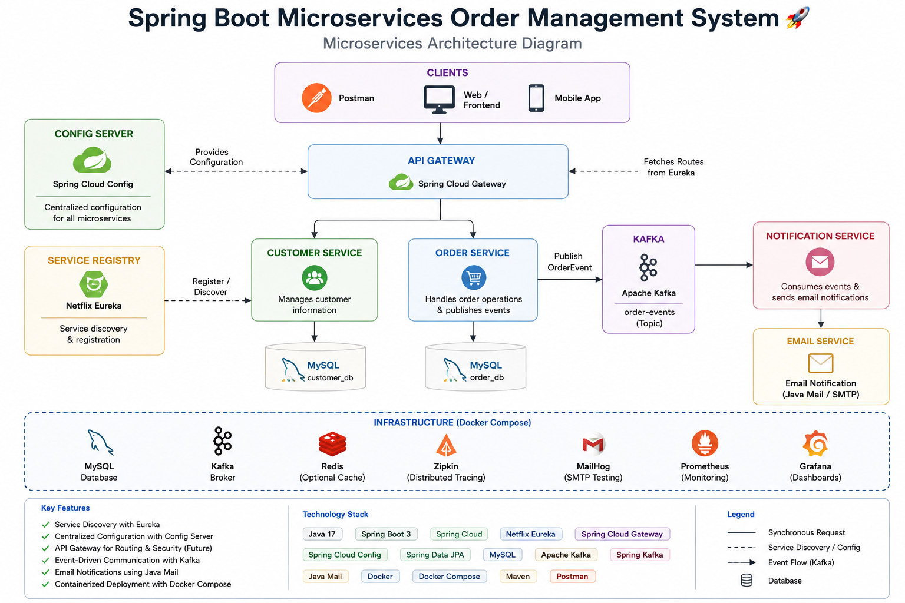

# Spring Boot Microservices Order Management System

A production-style microservices application built using Spring Boot and Spring Cloud.

The project demonstrates service discovery, centralized configuration, API Gateway routing, REST-based communication, Kafka event-driven messaging, email notifications, MySQL persistence, and Docker Compose container orchestration.

## Architecture Diagram

The system consists of the following microservices:

| Service | Responsibility |
|---|---|
| Service Registry | Eureka Server used for service discovery |
| Config Server | Provides centralized configuration for microservices |
| API Gateway | Single entry point and routes requests to backend services |
| Customer Service | Manages customer information |
| Order Service | Handles order operations and publishes order events to Kafka |
| Notification Service | Consumes Kafka order events and sends email notifications |

## High-Level Flow

Client / Postman  
↓  
API Gateway  
↓  
Customer Service / Order Service  
↓  
Kafka  
↓  
Notification Service  
↓  
Email Notification

All microservices register with the Eureka Service Registry and obtain centralized configuration through Spring Cloud Config Server.

## Tech Stack

- Java 17
- Spring Boot
- Spring Cloud
- Netflix Eureka
- Spring Cloud Gateway
- Spring Cloud Config
- Spring Data JPA
- MySQL
- Apache Kafka
- Spring Kafka
- Java Mail
- Docker
- Docker Compose
- Maven
- Git & GitHub
- Postman

## Microservice Repositories

The application is divided into independently maintained microservices:

- [Service Registry](https://github.com/kalyan-angadalu/service-registry)
- [Config Server](https://github.com/kalyan-angadalu/config-server)
- [API Gateway](https://github.com/kalyan-angadalu/api-gateway)
- [Customer Service](https://github.com/kalyan-angadalu/customer-service)
- [Order Service](https://github.com/kalyan-angadalu/order-service)
- [Notification Service](https://github.com/kalyan-angadalu/notification-service)
- [Microservices Config](https://github.com/kalyan-angadalu/microservices-config)

## Containerized Deployment

The complete microservices environment can be started using Docker Compose.

The Docker Compose configuration manages the application services and supporting infrastructure required by the system.

Detailed setup and execution instructions will be added below.

## Project Status

The core microservices architecture, Kafka communication, email notification flow, centralized configuration, service discovery, API Gateway, database integration, and Docker Compose setup are implemented.

Further improvements include cloud deployment, monitoring, centralized logging, security, and Kubernetes orchestration.
